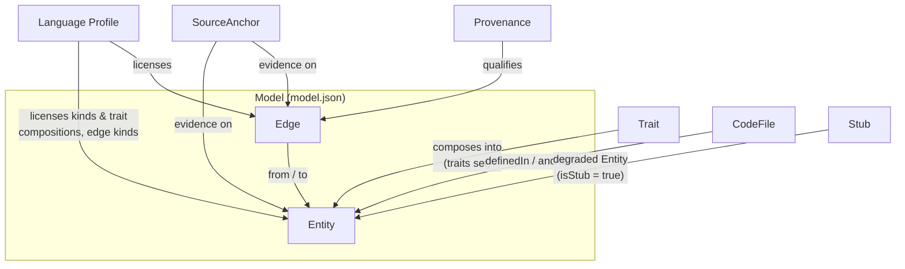

# Codegraph Metamodel Reference

Conceptual reference for the trait-based, multi-language code metamodel
(FamixNG lineage). Every concept is described with its **attributes** and its
**relations** to other concepts. The executable form of this document is
`@codegraph/core` (Zod schemas) and the generated `schemas/model.schema.json`;
if they ever disagree, the code is authoritative and this file has a bug.

Concept map:



---

## 1. Primitives

### 1.1 EntityId

Opaque string identifying an entity. Written as
`<lang>:<module>/<symbol>[#<disambiguator>]` but **consumers never parse it** —
they only compare it for equality. Uniqueness is per model union.

| Component | Role |
|---|---|
| `lang` | language prefix (`java`, `ts`, `clj`, …) |
| `module` | owning module path |
| `symbol` | entity name path within the module |
| `disambiguator` | signature for overloads/receivers; `(file, startLine)` for anonymous entities (lambdas, impl blocks); absent when the symbol is unique |

Multi-declaration tolerant: one id may be declared in several places
(TypeScript declaration merging, C# partial classes).

**Relations:** every reference between concepts (edge endpoints, `parent`,
`children`, `attachedTo`, `declaredType`, `candidates`) is an EntityId.

### 1.2 SourceAnchor

The *evidence* concept: where in the source a fact was observed.

| Attribute | Type | Meaning |
|---|---|---|
| `file` | string | path of the CodeFile, relative to the analyzed root |
| `span` | `[int, int]` | `[startLine, endLine]`, 1-based, inclusive |

**Relations:** attached to Entities (via the `TSourceAnchor` trait) **and** to
Edges (directly). Anchors on edges are what make every dependency claim
auditable.

### 1.3 Provenance

Enum qualifying *how we know* an edge exists. Never mix facts and inferences.

| Value | Meaning | Examples |
|---|---|---|
| `declared` | written literally in the source | explicit `extends`, direct call |
| `derived` | computed by analysis | Go implicit interface satisfaction, TS structural conformance, Python protocols, Rust blanket impls |
| `dynamic-candidate` | dispatch not statically resolvable; targets are guesses | multimethods, PHP `__call`, duck typing, `dyn Trait` |
| `generated` | produced by macro/annotation expansion | Rust `#[derive]`, Lombok, Python decorators, Clojure macros |

**Relations:** mandatory attribute of every Edge. Analyses wanting facts only
filter on `declared`.

### 1.4 Space

TypeScript-family concept: which declaration space(s) an entity occupies.

| Value | Meaning |
|---|---|
| `type` | exists only at type-check time (TS `interface`, `type`) — dependencies on it are erased at runtime |
| `value` | exists at runtime |

An entity may occupy both (a TS `class`). Optional attribute; only meaningful
in profiles that declare it (TypeScript).

### 1.5 CodeFile

A source file. Not reified as a first-class entity in most profiles — it
appears as `anchor.file` values and in `TModule.definedIn`. It becomes an
explicit node only where a language has file-level dependencies (PHP
`FileInclude` edges).

---

## 2. Entity

The single node concept. There is **no entity class hierarchy**: an entity is a
kind plus a *sum of traits*, and each trait contributes attributes.

| Attribute | Type | Always present | Meaning |
|---|---|---|---|
| `id` | EntityId | yes | identity, opaque |
| `kind` | string | yes | language-profile-defined classification (`class`, `method`, `function`, `namespace`, …) |
| `traits` | TraitName[] | yes | the capabilities this entity composes |
| `space` | Space[] | no | TS-family only, see §1.4 |
| *(trait keys)* | — | per trait | every trait in `traits` contributes its keys (§3) |

**Validity** (per the owning Language Profile, §5):
`required(kind) ⊆ traits ⊆ required(kind) ∪ optional(kind)`, and every declared
trait's keys are present and well-typed.

**Relations:**
- composed of **Traits** (§3);
- source or target of **Edges** (§4);
- classified and licensed by a **Language Profile** (§5);
- may be a **Stub** (§6).

---

## 3. Traits

A trait is a named micro-capability: a partial schema contributing zero or more
attributes to the entity that declares it. Composition is commutative and
associative; the trait vocabulary is closed and canonical (never renamed).

Traits marked *(marker)* contribute **no attributes**: they declare a
capability whose data lives in `edges[]` (edges are stored once, outgoing
direction only — see §4).

### 3.1 Base

| Trait | Attributes contributed | Notes |
|---|---|---|
| `TNamed` | `name: string` | Not universal: lambdas, closures, Rust impl blocks, Java constructors have no own name |
| `TSourceAnchor` | `anchor: SourceAnchor` | Evidence for the entity's declaration |
| `TComment` | `comments: string[]` | Attached documentation/comments |

### 3.2 Containment and attachment — two distinct relations

A strong design decision: *where an entity is written* (lexical containment)
and *what it semantically belongs to* (attachment) are different relations and
both are kept.

| Trait | Attributes contributed | Relation expressed |
|---|---|---|
| `TWithChildren` | `children: EntityId[]` | lexical containment, downward |
| `TChildOf` | `parent: EntityId` | lexical containment, upward (inverse of `TWithChildren` — both stored, must agree) |
| `TAttachedTo` | `attachedTo: EntityId` | semantic attachment. Required by: Go receiver methods, Rust `impl` blocks, C# extension methods, Clojure `extend-type`/`defmethod` |

Example where they diverge: a Go method with receiver `(o *Order)` is a
*child* of its file/package (where it is written) but *attached* to `Order`.

### 3.3 Modularity

| Trait | Attributes contributed | Notes |
|---|---|---|
| `TModule` | `definedIn: string[]` (CodeFile paths), `isStub: boolean` | module↔file cardinality varies by language: 1-1 (JS/TS/Python: module *is* the file), 1-N (Java package, C#/Go/PHP namespace), N-N (Rust inline `mod`). Rust modules are hierarchical (crate = root). `isStub` mirrors `TType`'s: the import graph is module-level (§9), so an import of an external module needs an endpoint that exists — a stub module has `definedIn: []`, which is exactly what makes it external |

### 3.4 Types

| Trait | Attributes contributed | Notes |
|---|---|---|
| `TType` | `isStub: boolean` | any type-like entity: class, interface, struct, enum, protocol, PHP/Rust trait |
| `TWithInheritances` | *(marker)* — see `Inheritance` edges | multiple inheritance = N edges (Python). Absent from Go/Rust profiles — that absence is profile information, not a gap |
| `TWithImplements` | *(marker)* — see `InterfaceImplementation` edges | |
| `TTypedEntity` | `declaredType?: EntityId` | optional even when the trait is present: absent value in JS/Python/Clojure, C# `var`, inferred Go/TS/Rust |

### 3.5 Behavior

| Trait | Attributes contributed | Notes |
|---|---|---|
| `TInvocable` | `signature: string` | signature is part of identity (Java/C# overloads, Go receivers) |
| `TWithParameters` | `parameters: EntityId[]` | ordered |
| `TWithLocalVariables` | `localVariables: EntityId[]` | |
| `TWithInvocations` | *(marker)* — see `Invocation` edges | outgoing only; incoming is derived by the analyzer, never stored |

### 3.6 Structure

| Trait | Attributes contributed | Notes |
|---|---|---|
| `TStructural` | *(marker)* — value holder | attributes, variables, parameters, Clojure vars. Legal target of `Access` edges |
| `TWithAccesses` | *(marker)* — see `Access` edges | outgoing only |

### 3.7 The composition that motivates the whole design

A Clojure var holding a function is simultaneously named, a value holder, and
invocable: `traits: [TNamed, TStructural, TInvocable]`. No tree-shaped
hierarchy can place it; trait composition expresses it directly.

---

## 4. Edges (associations)

The single relationship concept. Every edge, regardless of kind, carries:

| Attribute | Type | Required | Meaning |
|---|---|---|---|
| `edge` | EdgeKind | yes | discriminant, see table below |
| `from` | EntityId | yes | source |
| `to` | EntityId | yes | primary target (best candidate if uncertain) |
| `provenance` | Provenance | yes | how we know (§1.3) |
| `anchor` | SourceAnchor | yes | where observed |
| `candidates` | EntityId[] | no | possible targets when dispatch is uncertain; non-empty iff resolution was ambiguous |
| `sourceFile` | string | no | disambiguates which declaration site produced the edge (C# partial classes, TS declaration merging) |

Rules:
- **Outgoing only, stored once.** All inverse views (callers of X, subtypes of
  Y, importers of M) are derived in memory, never serialized.
- **Closure:** `from` and `to` must resolve to a known entity or a stub —
  a tested property of every model.
- **No self-reference:** `from ≠ to`.

### Edge kinds

| Kind | From → To | Extra attributes | Notes |
|---|---|---|---|
| `import` | Module → Module | | **First-class layer**: the only relation reliable ≈100% across all languages, hence the granularity for cross-language comparison. Rust has two levels (mod, crate) |
| `inheritance` | Type → Type | | N edges for multiple inheritance (Python); optional MRO order left to profile notes |
| `interfaceImplementation` | Type → Type (interface/trait/protocol) | | `declared` (Java `implements`) or `derived` (Go, TS structural) depending on language. For Rust/Clojure the anchor is the reified impl block (§7) |
| `invocation` | Invocable → Invocable | `candidates` | uncertain dispatch → `provenance: dynamic-candidate` + candidates list |
| `access` | Invocable → Structural | `isRead: bool`, `isWrite: bool` | field/variable reads and writes |
| `reference` | Entity → Type | | type usage that is none of the above (declarations, generics, casts, annotations) |
| `embedding` | Type → Type | | Go `struct { Base }` — neither inheritance nor attribute (method promotion); dedicated relation |
| `traitUsage` | Type → Trait (PHP) | | PHP `use TraitX;` — kept as a usage edge, never flattened into the class |
| `fileInclude` | CodeFile → CodeFile | | PHP `include`/`require` — the only file-to-file dependency in the metamodel |

**Relations:** edges connect Entities; are licensed per Language Profile
(a profile lists which edge kinds its extractor can emit); carry SourceAnchor
and Provenance.

---

## 5. Language Profile

A profile is **data, not code**: the contract stating what a given language's
extractor may produce. A profile must be *specifiable without being
implemented* (robustness test of the schema).

| Attribute | Type | Meaning |
|---|---|---|
| `lang` | string | language id, matches the EntityId prefix |
| `kinds` | `Record<kind, {required: TraitName[], optional: TraitName[]}>` | the licit trait compositions per entity kind |
| `edges` | EdgeKind[] | edge kinds this language can emit |
| `notes` | string[] | documented static-analysis blind spots (reflection, `Class.forName`, dynamic `require`, macros pre-expansion, …) |

**Validation** of an entity against its profile:
1. `kind` exists in the profile;
2. `required(kind) ⊆ entity.traits ⊆ required(kind) ∪ optional(kind)`
   (strict equality rejected — too brittle for `TComment`; free subset rejected
   — hides extractor bugs);
3. each declared trait's attributes are present and well-typed.

**Relations:** licenses Entities and Edges; cross-language analyses operate on
the **intersection** of the profiles involved (in practice: the `import` layer
plus whatever both profiles share).

---

## 6. Stub

Not a separate node type — an Entity with `isStub: true`, representing something
**external to the corpus** (JDK, npm packages, …). Exactly two traits contribute
`isStub`, so exactly two things are stubbable:

| Stub of | Trait | Shape | Why it must exist |
|---|---|---|---|
| a **type** | `TType` | usually only `TNamed + TType`, no children, no anchor | every corpus references types it does not declare |
| a **module** | `TModule` | `TNamed + TModule + TWithChildren`, `definedIn: []`, no children | the import graph is module-level (§9), so `import java.util.List` points at the *package* `java:java.util` — with no module stub the first-class import layer could never satisfy closure (§11 invariant) |

A **member** (method, field) is deliberately *not* stubbable: an external member
folds up to its declaring type's stub. Fabricating a `class` named `bill(Order)`
to close an endpoint is the one thing stub synthesis exists to prevent — an
unresolvable member id is reported and left dangling instead.

- Edges *to* stubs are kept; the internal-only view is obtained by filtering
  stubs out at analysis time — uniformly, for types and modules alike.
- Membership is decided by a **whitelist of corpus-declared ids** built in a
  first pass — never by package/name prefix (Spoon in noClasspath mode invents
  plausible FQNs; prefix filters would launder them into facts).

---

## 7. Reified impl block (anonymous attachment entity)

Verified against Rust (and improving Clojure `extend-type`): a block like
`impl Display for Order` attaches to *two* entities and owns methods, so it is
reified as an anonymous entity:

- `traits: [TWithChildren, TAttachedTo, TSourceAnchor]` — **no `TNamed`**;
- `attachedTo` → the type (`Order`);
- the `interfaceImplementation` edge `Order → Display` takes the block as its
  `anchor`;
- its methods are its `children`.

---

## 8. Model (the interchange file)

The unit of exchange between an extractor and the analyzer: one JSON document
per extraction run.

| Attribute | Type | Meaning |
|---|---|---|
| `schemaVersion` | semver string | version of the interchange contract |
| `lang` | string | profile id of the extractor |
| `extractor` | `{name, version, ...flags}` | provenance of the model itself (e.g. `noClasspath: true`) |
| `root` | string | analyzed source root (anchors are relative to it) |
| `entities` | Entity[] | all nodes, stubs included |
| `edges` | Edge[] | all relations, outgoing direction |

**Relations:** a model conforms to exactly one Language Profile; multi-language
analysis is the union of models (ids are globally unique thanks to the `lang`
prefix), queried through profile intersection.

---

## 9. Derived concepts (never serialized)

Computed by the analyzer from the stored model; listed here because they are
part of the conceptual vocabulary even though they never appear in
`model.json`:

| Concept | Derived from | Definition |
|---|---|---|
| Incoming indexes | all edges | callers-of, importers-of, subtypes-of, accessors-of — inverse of stored outgoing edges |
| Type-level dependency graph | all edge kinds | edges folded up to the containing `TType` entities |
| Module import graph | `import` edges | the cross-language comparison layer |
| Coupling metrics | folded graphs | fan-in/fan-out, afferent/efferent coupling, instability |
| Cycles | folded graphs | strongly connected components at module or type level |
| Internal view | `isStub` | model minus stubs and their edges |
| Facts-only view | `provenance` | model restricted to `declared` edges |

---

## 10. Worked example (Java profile)

```json
{
  "id": "java:com.acme.order/OrderService.bill(com.acme.order.Order)",
  "kind": "method",
  "traits": ["TNamed", "TInvocable", "TWithParameters", "TWithLocalVariables",
             "TWithInvocations", "TWithAccesses", "TTypedEntity", "TChildOf",
             "TSourceAnchor"],
  "name": "bill",
  "signature": "bill(com.acme.order.Order)",
  "declaredType": "java:com.acme.billing/Invoice",
  "parent": "java:com.acme.order/OrderService",
  "anchor": { "file": "OrderService.java", "span": [15, 22] }
}
```

Note the id's parameter types: **erased fully-qualified names**, not simple
names. Simple names genuinely collide — `archive(java.util.List)` and
`archive(com.acme.order.legacy.List)` are legal Java overloads that both render
as `archive(List)`, so under simple names they would merge into a single id and
one method would vanish from the model with no error. Ids must be unique, so the
FQN form wins; the `signature` attribute keeps the same form. (The fixture
corpus contains exactly that overload pair as a regression case.)

Reading it through the metamodel: the entity is a `method` **kind** whose
**traits** license each attribute — `TNamed` brings `name`, `TInvocable` brings
`signature` (also serving as the id's disambiguator), `TTypedEntity` brings
`declaredType` (the return type, itself an EntityId), `TChildOf` brings
`parent`, `TSourceAnchor` brings `anchor`. `TWithParameters` and
`TWithLocalVariables` reference child entities; `TWithInvocations` and
`TWithAccesses` are markers announcing outgoing `invocation`/`access` edges:

```json
{
  "edge": "invocation",
  "from": "java:com.acme.order/OrderService.bill(com.acme.order.Order)",
  "to": "java:com.acme.order/TaxCalculator.apply(double)",
  "provenance": "declared",
  "anchor": { "file": "OrderService.java", "span": [19, 19] }
}
```

A fact (`declared`), with evidence (line 19), between two internal entities
(neither is a stub) — it will survive both the internal-only and the facts-only
filters of §9.
