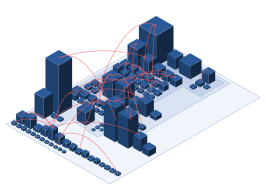

<p align="center">
  <picture>
    <source media="(prefers-color-scheme: dark)"
            srcset="website/static/img/codegraph-logo-long-white-text-red-brackets.svg">
    
  </picture>
</p>

<p align="center">
  <strong>See the structure of a codebase you did not write — even one that no
  longer compiles.</strong>
</p>

<p align="center">
  
</p>

<p align="center">
  <sub>The model codegraph extracted from
  <a href="https://github.com/google/gson">google/gson</a>, drawn as it is laid
  out. Nine packages as plates, nested like the packages they are; 113 classes
  as blocks whose height is lines of code and whose footprint is member count;
  in red, the cyclic dependencies.</sub>
</p>

Codegraph turns source code into a dependency model you can query, draw as a
3D city, browse dependency by dependency, replay through its git history, and
have a language model explain bottom-up. It does this without building the
code: the extractors run on sources alone — no classpath, no jars, no project
files — so they work on the legacy that nobody can compile any more.

Four questions, four commands:

| Question | Command | What you get |
|---|---|---|
| What does this codebase look like? | `codegraph serve` → City tab | a 3D city: packages are districts, classes are buildings sized by real metrics, dependencies are arcs — click a building to open it in the navigator |
| What exactly depends on what? | `codegraph serve` → Navigate tab | a browsable tree with every incoming and outgoing dependency, the member that carries it, and the source line that proves it |
| How did it get this way? | `codegraph scm` / `replay` | churn, hotspots, ownership, co-change, and a city whose timeline scrubs the years |
| What does it mean? | `codegraph explain` | one plain-language explanation per method, class and package, written leaves-first so every summary rests on already-explained parts |

Plus the plumbing you need to trust the answers: `validate` for the model,
`analyze` for coupling and cycles, `export` for DOT, CSV, JSON and PlantUML.

## Quick start

You need **Node 22+** and **pnpm** (`corepack enable pnpm`) for codegraph
itself, plus the toolchain of the extractor you intend to run: a **JDK 17+**
for Java, the **.NET 10 SDK** for C#, nothing more for TypeScript. Codegraph
is not on npm yet; you run it from a clone.

```bash
git clone https://github.com/defsquare/codegraph.git && cd codegraph
pnpm install && pnpm -r build
(cd extractors/java && ./mvnw -B package)        # Java: the wrapper, no local Maven needed
./build.sh --csharp                              # C#: needs the .NET 10 SDK, see below
ln -s "$PWD/bin/codegraph" ~/.local/bin/codegraph   # optional, works from a symlink
```

Now point it at some Java. Any tree of `.java` files works; it does not have
to build.

```bash
# 1. extract: sources in, one model file out (no compilation)
java -jar extractors/java/target/codegraph-java.jar --src ~/src/gson/gson/src/main/java --out gson.jsonl

# 2. is the model sound?
codegraph validate gson.jsonl

# 3. look at it: one page, the navigator with the 3D city as a tab
codegraph serve gson.jsonl --host 127.0.0.1               # http://localhost:4177
```

On google/gson (about 3,600 entities) extraction takes seconds and every
report runs well under a second. On apache/fineract (a 127 MB model) each
command completes in about twelve seconds.

`--host 127.0.0.1` keeps the page on your machine. Without it the server
binds every interface, which is convenient on a LAN and wrong for a sensitive
codebase.

TypeScript needs no other toolchain: the extractor is the compiler used as a
library, and it reads a tree that neither builds nor has `node_modules`.

```bash
./bin/codegraph-typescript --src ~/src/some-app/src --out app.jsonl
./bin/codegraph-typescript --src packages --src extractors/typescript --out codegraph.jsonl   # codegraph on itself
```

For C#, the extractor is a Roslyn program that reads `*.cs` directly: no
solution, no project file, no MSBuild, and a missing NuGet package is a stub
rather than a build failure. Building it needs the **.NET 10 SDK**:

```bash
# a user-local SDK, if the machine has none — a login shell's PATH is not
# visible to non-interactive shells, so export it:
curl -sSL https://dot.net/v1/dotnet-install.sh | bash -s -- --channel 10.0 --install-dir ~/.dotnet
export DOTNET_ROOT="$HOME/.dotnet"; export PATH="$DOTNET_ROOT:$PATH"

./build.sh --csharp                                       # → extractors/csharp/dist/<rid>/codegraph-csharp
extractors/csharp/dist/linux-x64/codegraph-csharp --src ~/src/eShop/src --out eshop.jsonl
```

Running it asks less than building it, and the three forms produce the same
bytes for the same corpus:

| The machine has | Run it as | Install |
|---|---|---|
| nothing | the self-contained binary `./build.sh --csharp` produced, about 64 MB with the runtime, the compiler and the base class library inside | nothing |
| the .NET 10 **runtime** | `dotnet codegraph-csharp.dll` from a framework-dependent publish, about 15 MB, produced once by someone with the SDK | .NET 10 runtime |
| the .NET 10 **SDK** | `dotnet run` from source, or a dev build | .NET 10 SDK |

The binary is built with invariant globalization, so a minimal Linux
container needs no `libicu`.
[`docs/csharp-extractor.md`](docs/csharp-extractor.md) has the rest: the five
platforms `./build.sh --csharp --publish-all` cross-publishes from one host,
and the one-time macOS quarantine and Windows SmartScreen notes.

Both extractors take the same flags and exit codes (`schemas/README.md` §8),
so every command below works on either model.

## Usage

### Ask the analyzer

```bash
codegraph analyze gson.jsonl --report coupling --top 20      # most depended-upon packages
codegraph analyze gson.jsonl --report cycles                  # tangles + the cheapest edges to cut; exit 3 if any
codegraph analyze gson.jsonl --report deps --level type       # class-level dependency list
codegraph export  gson.jsonl --format plantuml --level module > modules.puml
codegraph export  gson.jsonl --format dot > graph.dot
```

Two switches change every answer, and every answer says which were on:
`--internal-only` drops everything outside the corpus, `--declared-only`
drops every inference and keeps only what the source literally says.

### Build the city you want

Height and footprint are metrics you choose. The defaults are lines of code
and member count; the extractor also emits cyclomatic complexity:

```bash
codegraph serve gson.jsonl --height sum:cyclomatic --footprint loc
codegraph serve petclinic.jsonl --framework spring     # color by Spring role
codegraph city gson.jsonl --layout --out city.json     # the artifact alone
```

Arcs appear when you select something: orange for fan-in, blue for fan-out,
desaturated when the dependency is an inference rather than a declared fact,
and red for the edges whose cut would break a cycle. Hover a building for
its raw numbers. Unmeasured metrics are drawn at the minimum and labelled as
unmeasured rather than faked.

### Mine the history

```bash
codegraph scm ~/src/gson --out gson-history.jsonl
codegraph history gson-history.jsonl --report hotspots --top 20
codegraph history gson-history.jsonl --report hidden --model gson.jsonl
#   ^ files that change together though no declared dependency links them
codegraph history gson-history.jsonl --report deadweight --model gson.jsonl
#   ^ declared dependencies that history never exercised together
```

To watch the structure evolve, sample the repository at its tags into a
temporal store and replay it:

```bash
codegraph snapshots ~/src/gson --extractor extractors/java/target/codegraph-java.jar --tags --src gson/src/main/java --store gson.db
codegraph timeline java:com.google.gson/Gson --store gson.db
codegraph replay --store gson.db --history gson-history.jsonl --serve
```

`snapshots` is resumable; rerunning it skips the revisions already held.

### Let a model explain it

```bash
codegraph explain gson.jsonl --src ~/src/gson/gson/src/main/java --dry-run   # the plan, no call
codegraph explain gson.jsonl --src ... --estimate --price-in 0.10 --price-out 0.60   # tokens and cost, no call
OPENROUTER_API_KEY=… codegraph explain gson.jsonl --src ... --max-calls 50
```

Explanations go to `gson.insights.jsonl` beside the model and never into it.
Re-running redoes only the units whose inputs changed. On the reference
fixture a full run was 68 calls and about six cents. Cloudflare AI Gateway is
the other supported provider.

### Feed it to something else

`codegraph export --format json|csv` gives you the folded graph;
`codegraph import gson.jsonl` gives you `gson.db`, a SQLite file you can query
directly (see the [SQL cookbook](docs/sql-cookbook.md));
`codegraph domain-facts` gives one pre-joined dossier per class for
domain-model extraction. Every artifact is deterministic, so it diffs cleanly
in a repository or a CI job.

The complete option list for every command is in
[`docs/cli.md`](docs/cli.md) and in `codegraph <command> --help`.

## Why codegraph

Plenty of tools draw dependency graphs. Codegraph exists because most of them
demand a build, and because the ones that don't tend to guess quietly. Its
design bets are:

- **Facts and inferences never mix.** Every edge carries a provenance:
  `declared`, `derived`, `dynamic-candidate` or `generated`. A dependency
  the extractor resolved from the source is a different thing from one it
  inferred from a framework annotation, and every report, picture and
  export keeps the two visibly apart. You can always ask for facts only.
- **Every claim points at a line.** Entities and edges carry a source anchor.
  If the navigator says class A depends on class B through method `m`, it
  shows you the file and span where that happens.
- **Legacy is the target, not the exception.** The Java extractor runs Spoon
  without a classpath, and the C# one parses every `*.cs` into one compilation
  without ever opening a project file. What cannot be resolved becomes an
  explicit stub whose edges are kept, and stubs are decided by a whitelist of
  what the corpus declares, never by guessing from a package name.
- **One model, many languages.** Extractors emit a versioned line-based JSON
  file against a published JSON Schema and know nothing about the metamodel.
  Everything clever, from validation to metrics to the city, lives once, in
  TypeScript, so adding a language is writing a producer for one contract.
  Entities are trait compositions rather than a class hierarchy, which is what
  lets a Clojure function var, a Go method with a receiver, and a Java class
  live in one graph.
- **Pictures mean something.** In the city every visual channel maps to a
  documented metric and colour is never decorative. The renderer draws the
  model and nothing the model does not contain.
- **Time is part of the structure.** History mining, temporal snapshots and
  replay are built in, because who changed what together is a dependency the
  source cannot show you.
- **Boring outputs on purpose.** stdout is the artifact and stderr is for
  humans; no colour codes; byte-identical output for identical input; exit
  codes that separate a bug in codegraph from a finding about your code.

## Limitations

Read these before you commit an afternoon.

- **Two languages today: Java and C#.** The metamodel and the language
  profiles cover nine languages on paper, but the shipped extractors are
  Spoon for Java and Roslyn for C#. A Clojure adapter is next.
- **No build means imperfect resolution.** Without a classpath Spoon cannot
  resolve every Java reference; on the reference corpus resolution is around
  94%, and the rest are stubs. The C# extractor carries the base class
  library inside it, so the standard library always resolves and it is your
  NuGet dependencies that become stubs. A stub is honest, but it is still a
  gap.
- **For Java, keep one package to one source root per run.** `--src` is
  repeatable, but the same package declared under several roots at once (main
  and test sources, or one package split across modules) confuses noClasspath
  resolution; pass such roots in separate runs.
- **`explain` costs money and needs a network.** It is the only command that
  does. `--dry-run` and `--estimate` tell you what it would do first, and
  `--max-calls` caps it.
- **Not a linter.** Codegraph reports structure, coupling and cycles; it does
  not judge style or find bugs.
- **Runs from a clone.** There is no npm package or binary release yet.
- **Big models want memory.** A 100 MB model loads in the navigator in about
  a second, but the extractor and the analyzer are single-process Node and
  JVM tools; a monorepo of millions of lines is untested.

## How it works

```
   sources ──▶  extractor  ──▶  model.jsonl  ──▶  analyzer  ──▶  reports, exports
  (any state)  (Java: Spoon)  (the contract)      (TypeScript)      city.json ──▶ 3D city
               (C#: Roslyn)
               (TS: the compiler API)
                                   │                                navigator.json ──▶ navigator
                              schemas/*.json                        model.db ──▶ SQL, time
                            (published JSON Schema)                 *.insights.jsonl ──▶ explanations
```

The model is a graph of entities and edges. An entity is `{id, kind, traits}`
plus the attributes its traits contribute; an edge is `{from, to, kind,
provenance, anchor}`. Identity is a structured natural key
(`lang, module, symbol, disambiguator`), never a parsed string. Inverse
indexes (who calls me, who imports me) are derived in memory and never stored,
so a model file has one direction of truth. The full reference is
[`METAMODEL.md`](METAMODEL.md).

| Package | Role |
|---|---|
| `extractors/java` | Spoon-based extractor; emits `model.jsonl` |
| `extractors/csharp` | Roslyn-based extractor (no MSBuild, BCL embedded); one self-contained binary per OS |
| `extractors/typescript` | compiler-API extractor (no build, no `node_modules` needed); runs with `npx` |
| `schemas/` | the generated JSON Schema every extractor must satisfy |
| `packages/core` | traits, edges, language profiles, validation |
| `packages/analyzer` | graph, views, folding, cycles, coupling, exports, SQLite store |
| `packages/scm` | git history miner |
| `packages/city`, `packages/viz` | city model, Three.js renderer |
| `packages/navigator`, `packages/navigator-ui` | navigator model, React browser |
| `packages/insights`, `packages/llm` | the explanation walk, the provider clients |
| `packages/cli` | the `codegraph` command |

## Documentation

- [`docs/cli.md`](docs/cli.md) — every command and option
- [`METAMODEL.md`](METAMODEL.md) — every concept, attribute and relation in the model
- [`docs/analyzer.md`](docs/analyzer.md) — the analysis pipeline, its algorithms and costs
- [`docs/model-encoding.md`](docs/model-encoding.md) — the JSONL interchange and the SQLite store
- [`docs/sql-cookbook.md`](docs/sql-cookbook.md) — querying `model.db` yourself
- [`docs/city-model.md`](docs/city-model.md), [`docs/city-render.md`](docs/city-render.md) — how the city is built and drawn
- [`docs/csharp-extractor.md`](docs/csharp-extractor.md) — running the C# extractor: the self-contained binary, the .NET runtime alone, or the SDK from source
- [`docs/typescript-extractor.md`](docs/typescript-extractor.md) — running the TypeScript extractor, how it resolves without a build, reading its summary
- [`docs/navigator.md`](docs/navigator.md) — the navigator's design
- [`docs/insights.md`](docs/insights.md) — the explanation walk's design
- [`PLAN.md`](PLAN.md) — milestones, decisions and their rationale
- [`CLAUDE.md`](CLAUDE.md) — architecture boundaries and the metamodel invariants

## Status

Codegraph is pre-1.0 and is developed against real corpora
(google/gson, apache/commons-lang, apache/fineract, spring-petclinic). The
interchange format is versioned and the Java extractor's output over the
reference corpus is committed as a fixture, so any change in what it claims
about known code shows up as a diff.

| Milestone | State |
|---|---|
| Core metamodel, language profiles, JSON Schema | done |
| Java extractor (Spoon, no classpath) | done |
| Analyzer: dependencies, cycles, coupling, exports | done |
| CLI with conformance gate and property suite | done |
| JSONL interchange, SQLite analysis store | done |
| Git history mining, temporal store, city replay | done |
| 3D code city and the model navigator | done |
| Measures, literal values, Spring framework semantics | done |
| LLM explanations (`explain`) | done |
| Second language extractor (C#, Roslyn): one self-contained binary per OS, byte-identity smoke tests in CI on five platforms, audited on Humanizer, dotnet/eShop and OrchardCore | done |
| Third language extractor (TypeScript, the compiler API): no build, no `node_modules`, self-hosting — codegraph's own package boundaries recovered as graph queries; byte-identity smoke tests on three OSes; audited on TypeScript 4.9's compiler, nestjs and excalidraw | done |
| Clojure extractor (clj-kondo) | next |
| Published releases (npm, extractor jar) | planned |
| Project website and documentation site | planned, see [`WEBSITE.md`](WEBSITE.md) |

## Contributing

Bug fixes start with a failing test. The property suite, which checks graph
closure, provenance, determinism and profile validity over every extractor
output, is the acceptance gate for any new extractor. `pnpm run ci` runs what
the pipeline runs. Commits follow Conventional Commits with a package scope
(`feat(analyzer): …`). The architecture boundaries in
[`CLAUDE.md`](CLAUDE.md) are not negotiable; the open questions at the end of
each design doc are.

## Prior art and credits

- **Moose / FamixNG** (Pharo) — the trait-based metamodel is FamixNG's idea,
  reimplemented as data in TypeScript.
- **Spoon** (INRIA) — the Java source model that makes classpath-free
  extraction possible.
- **CodeCity** (Wettel & Lanza) — the city metaphor; codegraph adds
  provenance-aware arcs and time.
- **Structure101** — the tangle and feedback-set reports follow its
  "offending dependencies" idea.
- **Gource** and Adam Tornhill's *Your Code as a Crime Scene* — the history
  replay and the hotspot, ownership and co-change analyses.
- **Specy** — the domain vocabulary the explanations are written in.

## License

[MIT](LICENSE). Copyright (c) 2026 Defsquare.
