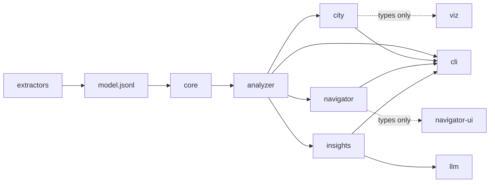

Codegraph is a pnpm workspace of ten TypeScript packages plus a Maven project.
That is more moving parts than a tool of this size usually needs, and the split
is not incidental — most of the package boundaries exist to make a specific
mistake impossible rather than merely inconvenient. This page walks the shape and
argues for each boundary.

## The pipeline

```
   sources ──▶  extractor  ──▶  model.jsonl  ──▶  analyzer  ──▶  reports, exports
  (any state)  (Java/Spoon)   (the contract)      (TypeScript)      city.json ──▶ 3D city
                                   │                                navigator.json ──▶ navigator
                              schemas/*.json                        model.db ──▶ SQL, time
                            (published JSON Schema)                 *.insights.jsonl ──▶ explanations
```

The key principle is that **extractors are federated behind one contract**. Each
extractor is free to use the best native tooling for its language — Spoon on the
JVM for Java today, with clj-kondo and the TypeScript compiler named in the plan
for the languages after it — and its only obligation is to produce conforming
records. Everything that knows what a trait
is, which compositions are legal, how to fold a graph or how to compute a metric
lives once, in TypeScript.

| Package | Role |
|---|---|
| `extractors/java` | Spoon-based extractor; emits `model.jsonl`. JVM code only. |
| `schemas/` | the generated per-record JSON Schemas and the container contract — committed |
| `packages/core` | traits, edge kinds, language profiles, validation, schema export |
| `packages/analyzer` | graph, views, folding, cycles, coupling, exports, the SQLite store |
| `packages/scm` | the git history miner |
| `packages/city` + `packages/viz` | the city model; the Three.js renderer |
| `packages/navigator` + `packages/navigator-ui` | the navigator model; the React browser |
| `packages/insights` + `packages/llm` | the explanation walk; the provider clients |
| `packages/cli` | the `codegraph` command |

Five of those are pairs, and every pair has the same shape: a **model** package
that is pure computation, and a **consumer** that renders or calls. That
repetition is the design, not a coincidence — it is the same argument applied
five times.

## Why the model/renderer split, five times over

Take the city. The transform from a code graph to districts, buildings and arrows
produces *data*: it positions nothing, chooses no colours, emits no geometry, and
imports no rendering library. The renderer reads that data and draws it.

Three things follow, and they are what the split is for.

**It is testable without a renderer.** "How tall is `OrderService`?" is a number
a unit test asserts on. Fused with the renderer, the same question is answered by
squinting at a screenshot, and regressions in it are found by nobody.

**The consumer becomes replaceable.** A second renderer — an SVG plan, a print
layout, a diff view — reads the same artifact. Nothing that matters is inside the
renderer, so replacing it costs nothing that has been thought about.

**The boundary is enforceable.** The model packages sit under a lint rule that
forbids the DOM and the rendering library. A violation is a failed build, not a
review comment somebody might miss on a busy day.

The same argument produced `insights` (pure walk, pure prompts, pure
fingerprints) beside `llm` (the only package that opens a socket), and
`navigator` beside `navigator-ui`.

**Why a package and not a folder.** The honest answer is vocabulary. The
analyzer's vocabulary is entities, edges, folds, views and metrics; districts and
buildings are a *different* vocabulary. Keeping them in one package invites
analyzer code to start reasoning in city terms, and the dependency then stops
running one way. As separate packages the direction is unambiguous and checkable:
city → analyzer → core, never back.

## The boundaries, and what each one prevents

### Model packages never import a browser library

`core`, `analyzer`, `city` and `navigator` must run in plain Node with no DOM.
They are what the command line calls, what the property suite runs against, and
what the two frontends consume. A DOM or rendering dependency anywhere in that
chain would make the CLI depend on a browser environment to compute a coupling
table.

The corollary is that neither frontend re-derives graph facts. Every role, owner,
member attribution and coupling number in the navigator was computed on the Node
side by the analyzer's own primitives, because a picture that computes its own
numbers is a picture that eventually disagrees with `codegraph analyze` — and
when that happens, the reader has no way to know which one is wrong.

### A frontend imports its model package for types only

This one is stated as a rule because it was learned as a bug.

A value import from a model package drags the whole Node pipeline behind it —
model package → analyzer → core → Zod → the SQLite loader — into the browser
bundle, and the build fails outright on a Node built-in the bundler cannot
externalize. It happened once, for a single convenience import of a constant that
listed the dependency roles.

The fix is not "remember not to do that". Constants a frontend genuinely needs —
the artifact's `kind`, the role vocabulary — are **restated as literals in the
frontend**, and a test asserts each equals the package's own, order included, and
scans the frontend's source for any non-type import of the package.


Restating a constant in two places is normally a smell. Here it is the lesser
evil: a duplicated literal with a test pinning it equal is safe, and a value
import that silently changes what a bundle contains is not. The rule is written
as a test because remembering it is exactly what failed.


### Extractors contain no metamodel intelligence

An extractor emits JSON conforming to the published schemas and nothing else. All
trait, profile and validation logic lives once, in `core`.

The reason is arithmetic. Every piece of metamodel logic placed in an extractor
gets reimplemented once per language, in a different language each time, by
someone who cannot run the TypeScript test suite. They will diverge, and the
divergence will be discovered as two tools disagreeing about a corpus.

Keeping the logic central is only possible if conforming is *easy*, which is why
the contract is [flat lines of JSON](/docs/explanation/why-jsonl/) rather than a
database or a binary format. The bar is "any language that can print JSON",
deliberately, and the schemas are committed and published so an extractor can
self-validate without importing a line of ours.

The gate is the other half. The property suite — graph closure, no self-reference,
the provenance set, profile validity, deterministic sorted output — runs against
**every** extractor output and is the acceptance criterion for a new extractor.
And when two extractors cover one language, the richer one is the oracle: the
other's edge set must be a subset of it, and any gap is a missed resolution case
rather than acceptable noise.

### The interchange is line-based and closed

One JSON record per line, sections in contractual order, identity carried as the
natural key, and every reference a file-scoped surrogate — so **a dangling
reference is unwritable, not merely reportable**. A producer that cannot close a
reference drops it and says so.

Moving an invariant from "the validator reports it" to "the format cannot express
it" is the strongest form the rule can take, and it is available here only
because the format was designed after the failure mode was known.

### Core owns the vocabulary

Trait names, edge kinds and provenance values are canonical and are never renamed
or aliased locally. This looks like pedantry inside one repository. It is not:
those names are the *only* thing a Java extractor and a TypeScript analyzer
share. An alias introduced for local convenience forks the contract for every
producer that is not in this repository.

The same closure is what licenses the encodings. Because the vocabularies are
finite sets owned by one place, a file may reference members by index into a
header dictionary and a database may reference them by foreign key, without
either of them redefining anything — and an unknown name is a hard error rather
than a passthrough.

### Only one package talks to a model provider

The provider SDK is imported in exactly one file, a boundary test scans the
workspace for the import, and the lint config restricts it. The insights walk,
the core, the analyzer and the CLI never open a socket, and every test in the
workspace runs against a fake client or a fake transport.

The suite therefore stays deterministic and free, which is what makes it possible
to test the interesting part — the walk order, the cycle condensation, the
fingerprints — properly. And explanations live in a side-car, never in
`model.jsonl` or `model.db`, because they are the one artefact that is not a pure
function of the model and must not contaminate one whose determinism is a tested
property.

## The direction of dependency



Every arrow points one way and none of them come back. The CLI depends on
everything and is depended on by nothing, which is what lets it be the place that
owns the filesystem, the environment and the printing — the three things every
other package is forbidden to touch.

The one arrow worth reading twice is the CLI's relationship with the frontends.
`codegraph serve` starts a server that hands out the navigator frontend's
**prebuilt static bundle** plus the in-memory artifacts — the navigator model
and the laid-out city, built from one graph. Three.js never enters the CLI's
import graph; the dependency is assets-only, resolved at runtime, and an unbuilt
frontend produces a usage error naming the build command rather than a crash.
Inside the frontend the same rule holds one level down: the navigator embeds the
city through `@codegraph/viz`'s mountable view and never imports `three` itself.

## What it costs

Ten packages is real overhead: ten build steps, ten test configurations, a
dependency graph to keep acyclic, and a handful of constants deliberately written
twice. Adding a trait means touching `core`, regenerating the schemas, and
possibly updating the store's key mapping — three commits' worth of ceremony for
one field.

That last one is also the best illustration of why the ceremony is there. The
store maps every key the wire can carry to the column or table that holds it, and
a test checks that mapping against core's own trait table *and* against the live
schema. So adding a trait key to `core` **fails the store** until someone decides
where it goes. The alternative — a new key that silently round-trips as unknown
data — is the kind of drift nobody notices until a user's model comes back
missing a field.

## Where this shows up

- [How to write an extractor](/docs/how-to/write-an-extractor/) — conforming to the
  contract from another language.
- [How to install](/docs/how-to/install/) — building the workspace, and why the
  frontends need a build before `serve` works.
- [The city is a model](/docs/explanation/city-is-a-model/) and
  [the navigator](/docs/explanation/navigator/) — the split, twice, in detail.
- [Why the interchange is a line-based file](/docs/explanation/why-jsonl/).
- [Explaining bottom-up](/docs/explanation/explaining-bottom-up/) — the pure/impure
  seam around the model calls.
- [Reference: the CLI](/docs/reference/cli/) — the one package that does I/O.
