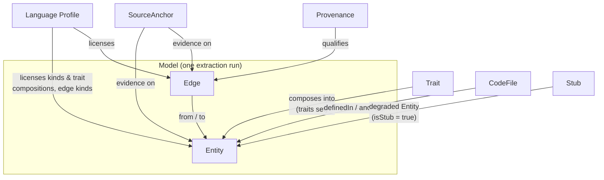

The trait-based, multi-language code metamodel (FamixNG lineage). Every concept is described with its **attributes** and its **relations** to other concepts.


`METAMODEL.md` in the repository is the canonical source for these pages. Its executable form is `@codegraph/core` (Zod schemas) and the generated `schemas/` contract; where the document and the code disagree, the code is authoritative.


## Pages

| Page | Concepts |
|---|---|
| [Identity](/docs/reference/metamodel/identity/) | the natural key, rendered ids, `SourceAnchor`, `Space`, `CodeFile` |
| [Traits](/docs/reference/metamodel/traits/) | the closed trait vocabulary and the attributes each contributes |
| [Edges](/docs/reference/metamodel/edges/) | the single relationship concept and its eleven kinds |
| [Provenance](/docs/reference/metamodel/provenance/) | the four values that qualify how a dependency is known |
| [Profiles](/docs/reference/metamodel/profiles/) | what a language profile is, and the validity rule |
| [Stubs](/docs/reference/metamodel/stubs/) | degraded entities for what the corpus does not declare |
| [Measures and literals](/docs/reference/metamodel/measures-literals/) | `TMetrics` and the `Literal` union |

The nine shipped profiles are rendered on [Language profiles](/docs/reference/profiles/).

## Concept map

## Entity

The single node concept. There is **no entity class hierarchy**: an entity is a kind plus a *sum of traits*, and each trait contributes attributes.

| Attribute | Type | Always present | Meaning |
|---|---|---|---|
| `id` | EntityId | yes | the natural key, rendered — compared, never parsed |
| `kind` | string | yes | language-profile-defined classification (`class`, `method`, `function`, `namespace`, …) |
| `traits` | TraitName[] | yes | the capabilities this entity composes |
| `space` | Space[] | no | TypeScript-family only |
| *(trait keys)* | — | per trait | every trait in `traits` contributes its keys |

**Validity** (per the owning language profile): `required(kind) ⊆ traits ⊆ required(kind) ∪ optional(kind)`, and every declared trait's keys are present and well-typed.

**Relations:** composed of traits; source or target of edges; classified and licensed by a language profile; may be a stub.

## The model

The unit of exchange between an extractor and the analyzer: the result of one extraction run. Its content is format-independent.

| Attribute | Type | Meaning |
|---|---|---|
| `schemaVersion` | semver string | version of the interchange contract |
| `lang` | string | profile id of the extractor |
| `extractor` | `{name, version, ...flags}` | provenance of the model itself (e.g. `noClasspath: true`) |
| `root` | string | analyzed source root (anchors are relative to it) |
| `repository` | `{remote, commit, root, provider?}` | optional — where the analyzed root lives in a hosted repository |
| `entities` | Entity[] | all nodes, stubs included |
| `edges` | Edge[] | all relations, outgoing direction |

`repository` records provenance of the *corpus*, as facts:

| Field | Meaning |
|---|---|
| `remote` | normalized https clone URL (`https://github.com/google/gson` — never the ssh form, never trailing `.git`) |
| `commit` | the sha the corpus was extracted at — a permalink; a branch name moves and is not a fact |
| `root` | path of the analyzed root **relative to the repository root**; anchors are relative to the *analyzed* root, which may sit below it |
| `provider` | `github` \| `gitlab`, only when the hostname does not say (self-hosted) |

The blob URL of a particular host is a **projection** consumers derive, never serialized.

### Integrity properties

Whatever encodes it, a model satisfies:

- **closure** — every reference resolves to a declared entity or a stub, the ids inside `Literal` values included;
- **no self-reference** — `from ≠ to` on every edge;
- **provenance set** on every edge, from the closed set;
- **profile validity** for every entity;
- **natural-key uniqueness** — no two entities share `(lang, module, symbol, disambiguator)`;
- **canonical order** — entities and edges sorted by natural key, so two runs over one corpus are diffable.

A model conforms to exactly one language profile; multi-language analysis is the union of models, queried through profile intersection. The interchange encoding is [`model.jsonl`](/docs/reference/model-jsonl/); the derived cache is [`model.db`](/docs/reference/model-db/).

## Reified impl block

A block like `impl Display for Order` attaches to *two* entities and owns methods, so it is reified as an anonymous entity:

- `traits: [TWithChildren, TAttachedTo, TSourceAnchor]` — **no `TNamed`**;
- `attachedTo` → the type (`Order`);
- the `interfaceImplementation` edge `Order → Display` takes the block as its `anchor`;
- its methods are its children.

## Derived concepts

Computed by the analyzer from the stored model; part of the vocabulary even though no encoding stores them.

| Concept | Derived from | Definition |
|---|---|---|
| Incoming indexes | all edges | callers-of, importers-of, subtypes-of, accessors-of — inverse of stored outgoing edges |
| Children index | `parent` | children-of — the inverse of the stored containment link |
| Type-level dependency graph | all edge kinds | edges folded up to the containing `TType` entities |
| Module import graph | `import` edges | the cross-language comparison layer |
| Coupling metrics | folded graphs | fan-in/fan-out, afferent/efferent coupling, instability |
| Cycles | folded graphs | strongly connected components at module or type level |
| Tangle / minimum feedback set | folded graphs | per-SCC minimal weighted edge set whose removal leaves the component acyclic; tangle metric = feedback references / cyclic references |
| Internal view | `isStub` | model minus stubs and their edges |
| Facts-only view | `provenance` | model restricted to `declared` edges |
| Source links | `repository` + anchors | per-anchor host permalink — `{remote}/blob/{commit}/{root}/{file}#L{s}-L{e}` on GitHub, `{remote}/-/blob/{commit}/{root}/{file}#L{s}-{e}` on GitLab; template chosen by hostname, `provider` overriding |
| Framework roles | `annotationUse` edges + a framework profile | stereotype classification of types and identification of injection points |
| DI wiring | injection points + the interfaceImplementation inverse index | `dynamic-candidate` edges from a consumer to every corpus implementation of the injected interface |
