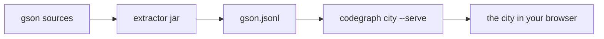

**What you will build.** A 3D city of Google's [gson](https://github.com/google/gson)
library, orbiting in your browser: every package a district, every class a
building sized by real metrics, every dependency an arc you can call up by
clicking.

**What you need.**

- codegraph installed from a clone and built — see [Install](/docs/how-to/install/).
  You will use the `codegraph` command and the extractor jar it builds.
- A JDK 17 or newer on `PATH`. Check with `java -version`.
- `git`, and about 50 MB of disk for the clone.

**How long.** About 15 minutes, most of it the clone.

Nothing here compiles gson. The extractor reads sources and nothing else, which
is the whole point: it works the same on code that no longer builds.



## 1. Make a place to work

Everything you produce in this tutorial is disposable. Keep it out of your
source trees.

```bash
mkdir -p ~/codegraph-tutorial && cd ~/codegraph-tutorial
```

The extractor is a jar, not a command. Point a shell variable at it once so the
lines below stay readable — replace the path with your own clone:

```bash
JAR=~/src/codegraph/extractors/java/target/codegraph-java.jar
```

## 2. Get a corpus

This tutorial pins gson at the release tag **`gson-parent-2.14.0`**, so your
numbers match the ones printed here.

```bash
git clone --depth 1 --branch gson-parent-2.14.0 https://github.com/google/gson gson-2.14.0
```

## 3. Extract the model

One source root, one model file.

```bash
java -jar "$JAR" --src gson-2.14.0/gson/src/main/java --out gson.jsonl
```

The extractor prints its resolution summary on stderr:

```text
RESOLUTION SUMMARY
  type references : 37336
  resolved        : 37171
  unresolved      : 165
  resolution rate : 99.6%
  entities        : 3594 (stubs: 175)
  edges           : 8997 (self-edges dropped: 0)
```

Read that as a report on the extraction, not on gson. Without a classpath some
references cannot be resolved; those 175 **stubs** are external types codegraph
only saw through their uses. It keeps their edges rather than dropping them, so
the picture stays honest about its own gaps.


Point `--src` at **one** source root. A repository with the same package split
across several roots (main and test, or several modules) confuses classpath-free
resolution. gson has several source roots; this tutorial uses only
`gson/src/main/java`.


Takes about five seconds. You now have a 1.7 MB `gson.jsonl`.

## 4. Check the model before you trust it

```bash
codegraph validate gson.jsonl
```

```text
checked 1 model — 3594 entities (175 stubs), 8997 edges, lang java
  gson.jsonl

OK — every model conforms: closure, no self-reference, provenance, candidates, profile, anchors, ids.
```

That is the conformance gate every extractor has to pass: no edge points at an
unknown entity, no entity depends on itself, every edge carries one of the four
provenance values, every entity and edge carries a source anchor. `validate`
exits `0` here; a model with findings exits `3`.

## 5. Open the city

```bash
codegraph city gson.jsonl --name gson --serve --host 127.0.0.1
```

```text
warning: 10 types left out — the model gives them no module, so there is no district to stand them in.
warning: 29 arrows dropped — an endpoint is not a building in this view.
warning: height is unmeasured on 150 buildings (metric loc) — those are drawn at the channel minimum, not at zero.
city visualizer at http://localhost:4177/ — Ctrl-C to stop.
```

Open <http://localhost:4177/>.

The warnings are the city telling you what it could not draw, before you ask.
The last one matters: 150 buildings have no line count because they are stubs —
codegraph never measured their source. They are drawn at the channel minimum
**and labelled unmeasured**, never at zero, because "shortest" and "unknown"
must not look the same.

`--host 127.0.0.1` keeps the page on your machine. Without it the server binds
every interface, which is handy on a LAN and wrong for a codebase you care
about.

<!-- screenshot: the gson city at a user-facing camera angle — pale ground, cool-paper district plates, teal buildings, nested plates for com.google.gson and its sub-packages, flat external plates around them, tall JsonReader/Gson/TypeAdapters towers, no arcs drawn at rest -->

## 6. Look around

Three moves, in this order:

1. **Drag** to orbit, **scroll** to zoom. You are looking at 23 districts and
   263 buildings. The tallest tower in the city stands in the
   `com.google.gson.stream` plate.
2. **Hover a building.** A card names it and shows its raw metrics — the
   numbers behind the shape, not a rounded version of them. That tallest tower
   is `JsonReader`, `loc` 1681, `members` 209. The tallest one in the
   `com.google.gson` plate is `Gson` itself, `loc` 1131, `members` 146.
3. **Click a district plate.** It brightens, a card lists its buildings and
   nested districts, and its module-level arcs appear — amber for what depends
   on it, blue for what it depends on. Click the same plate again, or the bare
   ground, to clear the selection.

Dependency arrows are hidden until you select something. That is deliberate: a
corpus this size has 1409 type arcs, and all of them at once is a hairball, not
a picture.

<!-- screenshot: the com.google.gson district plate selected — plate brightened, its detail card open, amber fan-in and blue fan-out arcs lifted over the skyline -->

## 7. Stop the server

`Ctrl-C` in the terminal. The city was served from memory; nothing was written.

If you want the artifact on disk instead of a server:

```bash
codegraph city gson.jsonl --name gson --layout --out city.json
```

That file is the renderer's only input. You can hand it to someone with no
codegraph checkout and they can drop it on the same page.

## What you have now

- `gson.jsonl` — a validated dependency model of gson 2.14.0, extracted from
  sources alone, with 3594 entities and 8997 edges.
- A city you can orbit, with every visual channel bound to a metric that the
  legend names.
- The habit of running `validate` before believing a picture.

Keep `gson.jsonl`. The next three tutorials use it.

## Where to go next

- [Reading a city](/docs/tutorials/reading-the-city/) — what the heights, colours and
  arcs actually mean, and how to check them against the analyzer.
- [Finding what depends on a class](/docs/tutorials/navigator/) — the same model, one
  dependency at a time, with the source line that proves each one.
- [Extracting without compiling](/docs/explanation/extracting-without-compiling/) —
  why stubs exist and why a package-name prefix would have lied to you.
